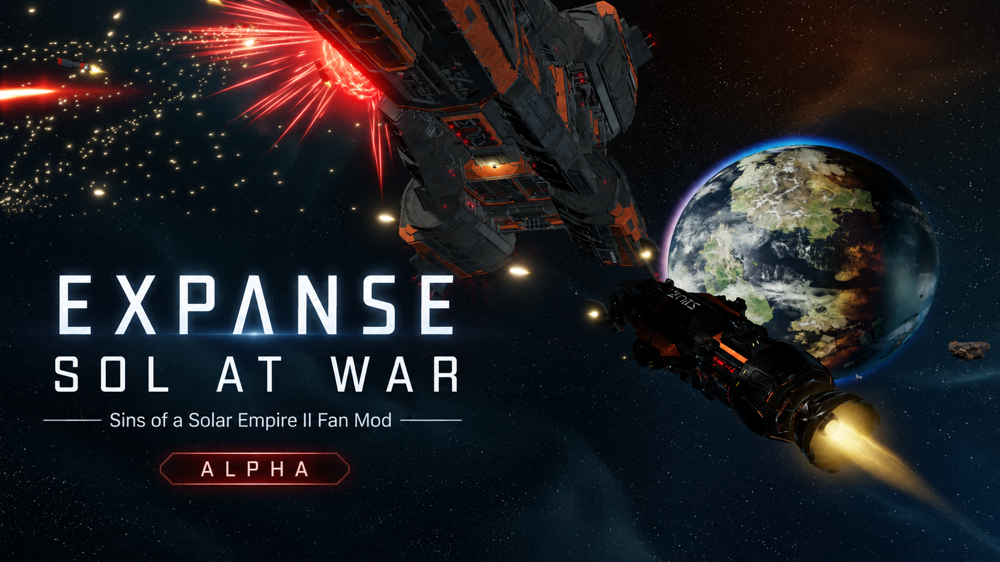
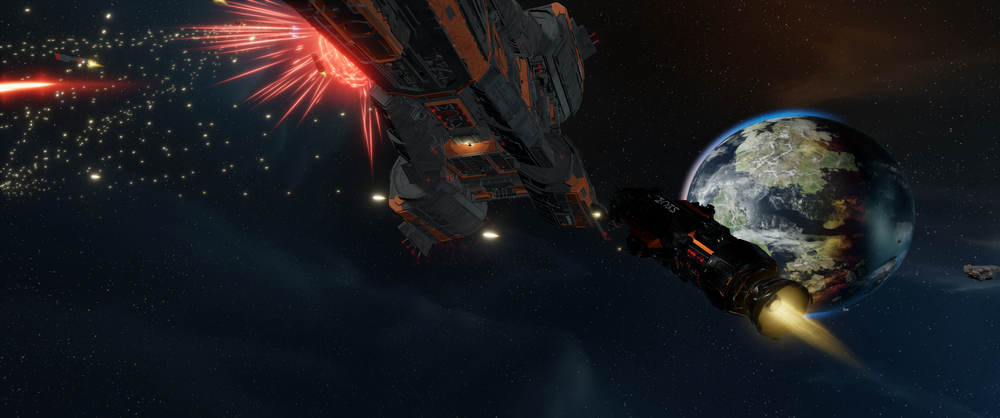
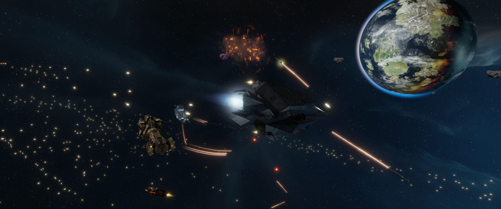

# Expanse: Sol at War

Bring the struggle between Earth, Mars and the Belt to **Sins of a Solar Empire II**. Build familiar ships, develop your faction's fleet doctrine, and fight through close-range PDC screens, torpedo salvos and punishing railgun exchanges. This is an unofficial *The Expanse* fan mod in active alpha development.

**[Download the latest alpha ZIP](https://github.com/Blean69/The-Expanse-Sins-of-Sol/releases/tag/v0.28-b120-c4)** · [See what changed](docs/current-release.md)

## Choose your fleet

- **MCRN:** advanced warships including the Tachi, Morrigan, Raptor, Scirocco, Hephaestus and Donnager.
- **UNN:** sturdy Earth ships including the Truman, Murphy, Nathan Hale and Munroe, with Amun-Ra stealth technology.
- **OPA:** Belt and Free Navy ships including the Pella, Europa's Bane, Dark Star and Behemoth.
- **Combined Fleet:** an optional fourth sandbox faction that can build the ships and research of all three powers in one game.

Capital ships and small escorts play different roles. Point-defense cannons can screen incoming torpedoes, fast ships can pressure heavier railgun platforms, and shieldless combat rewards positioning and timing. Military research and ship equipment extend each faction's fleet without removing its identity. Ship art, audio and the main-menu battle are part of the current build.

## Install

1. Download the ZIP from the [latest release](https://github.com/Blean69/The-Expanse-Sins-of-Sol/releases/tag/v0.28-b120-c4).
2. Extract its contents into a new folder inside the Sins II `mods` directory. The extracted folder should contain `.mod_meta_data` at its top level.
3. Enable **The Expanse — B120 Combined Fleet Fourth Faction** in the game's Mods menu. Enable only one Expanse package at a time and start a fresh game.

On Windows the mods directory is usually `%LOCALAPPDATA%\sins2\mods\`. For Steam Proton, use the corresponding `steamapps/compatdata/1575940/pfx/drive_c/users/steamuser/AppData/Local/sins2/mods/` directory.

This **0.28 B120 Combined Fleet** alpha preserves the three regular factions and adds the combined sandbox. It has passed offline file, schema and prerequisite checks; the released archive differs from the local candidate only in its updated asset-credit document. C4 gameplay, save/reload and multiplayer have **not yet been observed in a test**. Please report bugs with the game version, faction, steps to reproduce and relevant log lines.

## Project details

The build targets Sins II **2.0.3 (318)**. [Release details and SHA-256](docs/current-release.md) · [Exact B120 balance changes](docs/balance28_B120.md) · [Asset credits and provenance](ASSET-SOURCES.md) · [Build environment](docs/environment.md).

Project-authored source is available for personal noncommercial forks under [PolyForm Noncommercial 1.0.0](LICENSE). Third-party models, art, music, voices and game files retain their own terms; see [release readiness](docs/open-source-readiness.md). *The Expanse* and Sins of a Solar Empire II belong to their respective owners. This project is not affiliated with or endorsed by them.
